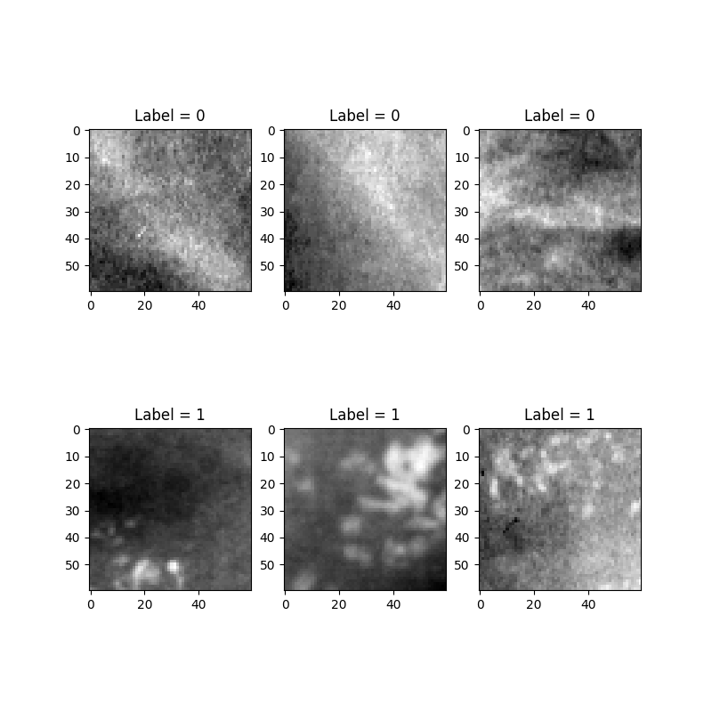
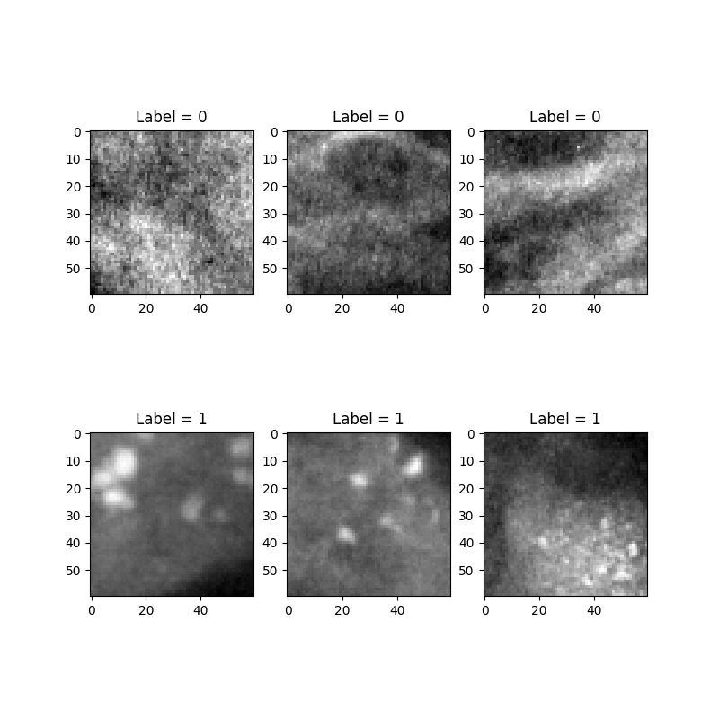
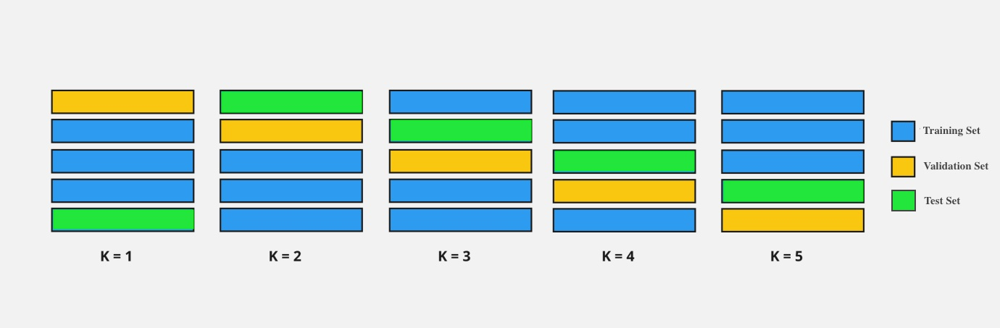
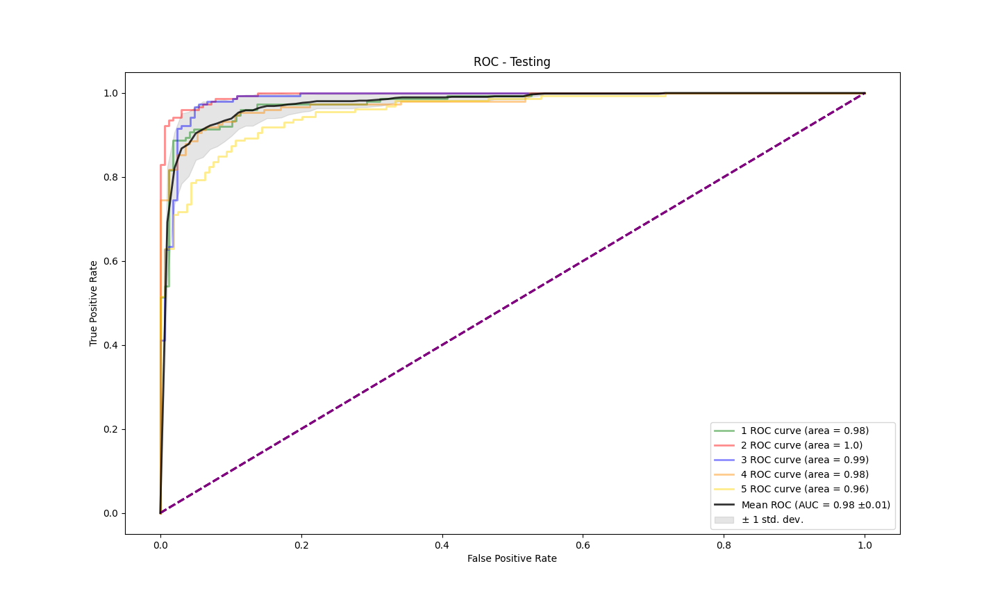
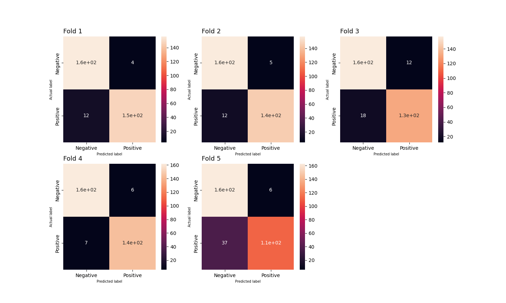
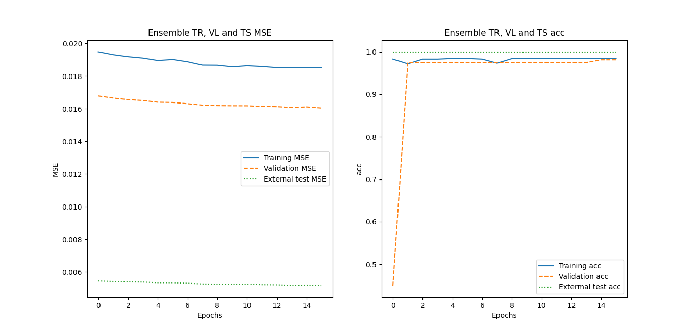
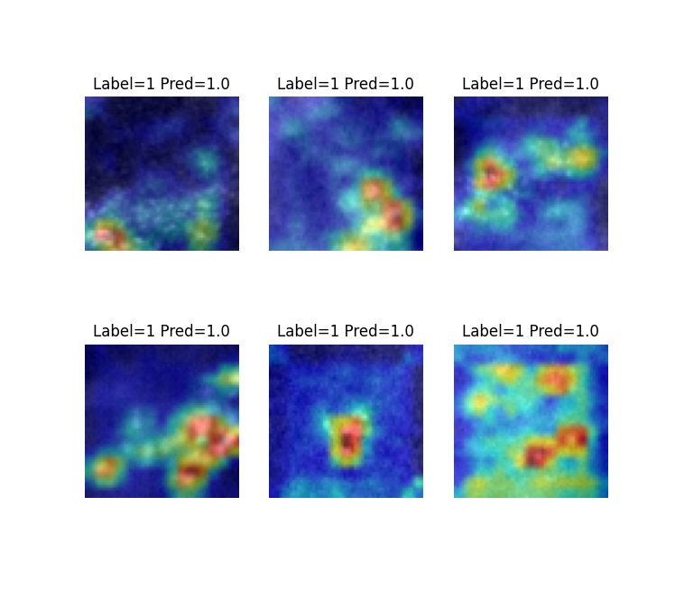

# mammo_classifier
Ensemble of CNN models for microcalcifications detection.
<br>

[](https://cmepda_prj.readthedocs.io/en/latest/?badge=latest)
 
[](https://dl.circleci.com/status-badge/redirect/gh/depoale/mammo_classifier/tree/main)     

The aim of this project is to build and train an ensemble of Convolutional Neural Network (**CNN**) models for a deep-learning based classification of normal breast tissue VS breast tissue containing microcalcification clusters in mammograms’ small portions. The neural networks will be developed using mainly `keras` and `PyTorch` libraries. <br>

# Dataset
The employed [dataset](https://www.pi.infn.it/~boccali/DL\_class\_data.tar.gz) is made up of **797** images, **414** of which represent normal breast tissue (they are labelled with "0") while the remaining **383** show breast tissue presenting microcalcifications clusters (they are labelled with "1"). <br>
Here are some examples:
 

## Pre-processing
Since the images were already standardised (size: 60x60, colormap: grayscale), only the normalisation of the pixel values to a (0,1) range was added in the pre-processing stage.

# Data transformations
The user can select whether to use the aforementioned default dataset as it is or to perform data augmentation or Wavelet-based filtering on its images by setting `augmentation` or `wavelet` parameters to be `True`.

## Data augmentation
In our case, data augmentation procedures are implemented using `keras.ImageDataGenerator`.  
Here are shown some examples of "augmented" images generated starting from the initial dataset. 


## Wavelet-based filtering
Wavelet-based filters are often used in medical imaging in order to enhance images' information content, which mostly means improving the visibility of features of interest. <br>
This part of the project is developed in `Matlab` and embedded in `Python` using `matlab.engine`.<br>
Among the many Wavelet families available, the user can set the `wavelet_family` parameter to be `sym3` or `haar`. The decomposition level is set to be 3 and the threshold for the decomposition coefficients can be set in terms of the standard deviations of their distributions by the user with the parameter `threshold`. In this case, best performances are obtained within 2 stdev. <br>
Here are some examples of images obtained with Wavelet-based filtering: 
 <br>

## External dataset
At the end of the training phase, the final model will be tested on an external [dataset](https://data.mendeley.com/datasets/ywsbh3ndr8/2) of mammograms' portions, in order to assess its generalization capability and its overall performance. Here are some hand-selected 60x60 sections from this dataset:   
 <br>

Note that, since these healthy mammograms' sections are fairly different from the ones seen by the model during the training phase in the initial dataset, only the ones containing microcalcifications will be employed in the final test phase. 

# Hypermodel
The deisgned hypermodel for the CNN classifier is made up of three convolutional blocks (containing `Conv2D`, `BathcNormalization`, `MaxPooling2D` and `Dropout` layers by `keras`) and a final fully-connected block (containing `Dense` layers by `keras`).
This architecture can be modified by the user by setting different values to the 3 available hyperparameters: <br>
- `dim`: the number of output filters in the first convolution (this number doubles after each Conv2D layer) <br>  
- `depht`: the number of Dense layers in the fully connected block <br>
- `rate`: dropout rate <br>
<br>
Note that these parameters influence the model’s complexity, its generalisation capability and its performance.
The default hyperparameters values are shown in the following tab: <br>

| Hyperparameters   |     Values    | 
| ----------------  | ------------- |
| `dim`             |  15, 20,25    | 
| `dropout rate`    |  0, 0.05,0.1  | 
| `depth`           |  1,3,5        | 

Here is the scheme representing the architecture of the designed CNN hypermodel.
 <br>

# Model selection and model assessment
The model selection and model assessment procedure is presented in the diagram below: given an hypermodel and an hyperparameters space, the best model is selected with an internal Hold-out (validation set = 25% of development set). A K-fold cross-validation (K=5) procedure is chosen to evaluate each model’s performance.
 <br>

Using `keras-tuner.BayesianOptimizator`, hyperparameters search is performed, exploring the user-selected `searching_fraction` of the space (default fraction = 25%), so that suitable hyperparameters values are chosen for each of the five folds. <br>
Since this step is computationally expensive, it is possible to skip it if the user sets the `fast_execution` parameter to be `True`. By doing so, the hyperparameters for each fold will be set to pre-saved values without any search.

# Ensamble
At this point we are left with 5 trained models or "experts" (one for each fold), so an ensemble learning strategy is implemented using `PyTorch`.
The response of the "committee" is going to be a weighted average of the single predictions. The weights of the ensamble are trained to maximise its accuracy and represent the reliability of each expert among the committee.
We want to keep the weights inside the range (0,1) and normalised, so that each weight represent the "contribution" of each model in the final response. In order to implement this, `WeightNormalizer` (a costum-made callable class) is applied after each optimiser step.
Finally, the ensemble’s performance is tested on the external dataset of mammograms' portions that we have already introduced. 

# Classes
In order to implement the workflow described so far, two costum-made classes were built: `Data` and `Model`. <br>
• `Data` class is used to handle and manage the datasets of mammography gray-scale images to be processed: it is called to perform data augmentation and Wavelet-based filtering procedures and contains the `get_random_images method`, a useful funcion which returns random images from one or both classes (Label = 0 and Label = 1) of a certain dataset. <br>
• `Model` class is used to carry out the aforementioned models’ training and ensamble strategy. It is equipped with many methods, such as: <br>
– `tuner`, which performs the hyperparameters search in the hyperparameters space set by the user <br>
– `fold`, which performs K-fold (in our case K = 5) for cross validation <br>
– `get_predictions`, which returns each model’s prediction for all the images (used as input for the ensemble model <br> 
– `get_ensemble`, which trains and then saves the ensembl

# Results
Using the default values for the hyperparameters, an example of the classificator's performance is shown in the following plots: <br>
- Learning Curves recorded for one fold
 <br>
- ROC curves and AUCs relative to the testing data for each fold 
 <br>
- Confusion Matrices for each of the 5 folds
 <br>
- Learning and Testing curves for the models' ensamble
 <br>

# GradCAM and interpretability
As part of the analysis, we included the possibility to "visualise" what the model has learnt using GradCAM algorithm (Gradient-weighted Class Activation Mapping). Selecting the most reliable of the five model (according to the ensemble's weights), the GradCAM algorithm was employed to highlight which regions of an input image are relevant in the decision making
process. <br>
The user can choose (by setting the parameter `gradcam`) the number of images randomly extracted from the dataset to visualize through the GradCAM.  
Here are some examples of mammograms' portions visualised with GradCAM: 
 <br>

# Usage
Simply download this repository and run using default parameters.
```
cd mammo_classifier/mammo_classifier
python3 main.py
```
If you are running the code for the first time, make sure you install the requirements:
```
pip install -r requirements.txt
```
Beware that, in order to use the wavelet-filtering feature, your device must have **`MATLAB`** (latest version: R2022b) and the `Python` module **`matlabengine`** already installed (they are **not** included in the project's requirements).

In order to change the parameters, refer to the help:
```
python3 main.py -h

usage: main.py [-h] [-aug] [-wave] [-wave_fam] [-thr] [-fast] [-depth  [...]]
               [-dim  [...]] [-dropout  [...]] [-sf] [-gcam]

Mammography classifier

options:
  -h, --help            show this help message and exit
  -aug , --augmented    Whether to perform data augmentation procedure.
                        Default: False
  -wave , --wavelet     Whether to apply wavelet filter.  Default: False
  -wave_fam , --wavelet_family 
                        Wavelet family choice (between 'sym3' and 'haar').
                        Default: 'sym3'
  -thr , --threshold    Threshold of wavelet coefficients in terms of the
                        stdev of their distributions (do not go over 2!).
                        Default: 1.5
  -fast , --fast_execution 
                        If True avoid hyperparameters search and use the
                        pre-saved hyperpar. Default: True
  -depth  [ ...], --net_depth  [ ...]
                        List of values for the hypermodel's depth
  -dim  [ ...], --Conv2d_dim  [ ...]
                        List of values for the hypermodel's conv2d initial
                        value
  -dropout  [ ...], --dropout_rate  [ ...]
                        List of values for the hypermodel's dropout rate
  -sf , --searching_fraction 
                        Fraction of the hyperparamiters space explored during
                        hypermodel search
  -gcam , --gradcam     Number of random images to visualize using gradCAM
```


