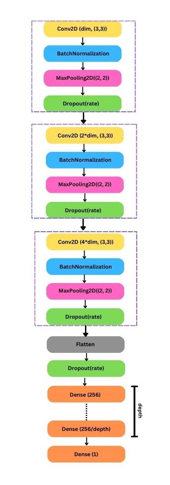
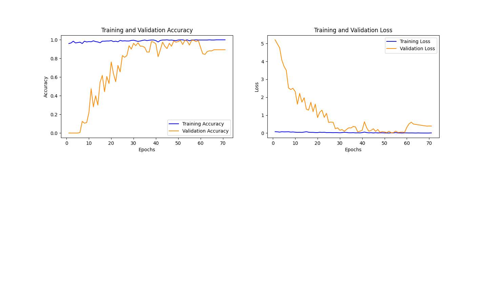
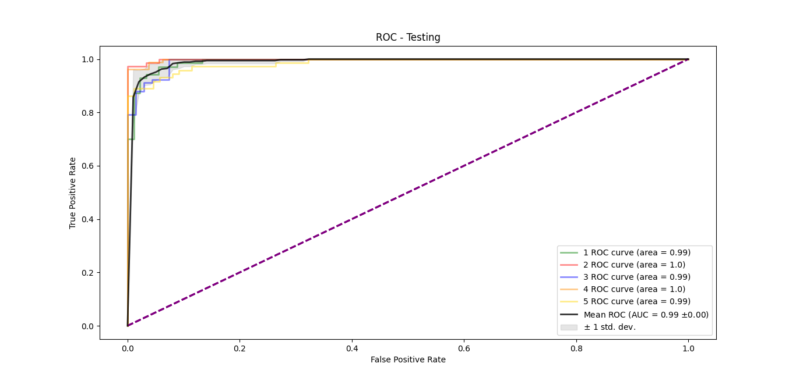
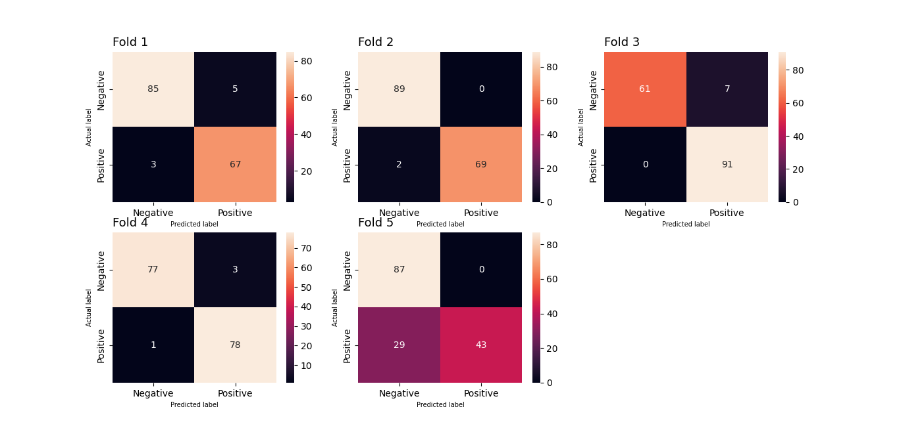

# Classificator for microcalcification in mammographies

 
     

The aim of this project is to build and train an ensemble of Convolutional Neural Network (CNN) models for a deep-learning based classification of normal breast tissue VS breast tissue containing microcalcification clusters in mammograms’ small portions. The neural networks will be developed using mainly **keras** and **PyTorch** libraries.  
Microcalcifications are tiny bright spots with a diameter of few hundred microns, that are commonly found in mammography screenings, even though their presence might be masked by the highly heterogenous surrounding breast tissue. While isolated microcalcifications are generally benign, when they turn up grouped in clusters with suspicious morphology and distribution patterns, they are associated with the risk of malignancy.  

# Dataset
The employed dataset of mammograms' sections is available on the INFN website (source: https://www.pi.infn.it/~boccali/DL\_class\_data.tar.gz. This dataset is made up of 797 images, 414 of which represent normal breast tissue (they are labelled with "0") while the remaining 383 show breast tissue presenting microcalcifications clusters (they are labelled with "1").  
Here are some examples:
 

## Pre-processing
Since the images were already standardised (size: 60x60, colormap: grayscale), only the normalisation of the pixel values to a (0,1) range was added in the pre-processing stage.

# Data transformations
The user can select whether to use the aforementioned default dataset as it is or to perform data augmentation or Wavelet-based filtering on its images.

## Data augmentation
Since medical datasets are usually **small** (a few hundred samples), oftentimes performing data augmentation procedures is essential. This should help prevent overfitting during the training process of the neural network, hence it may improve both the regularization and generalization capability of the given model.
In our case, data augmentation procedures are implemented using **keras.ImageDataGenerator**. 
This tool applies a series of random transformations to the original images of the dataset, such as rotations, vertical and horizontal flips, contrast modifications, rescalings and many others.   
Here we  report some examples of "augmented" images generated with this procedure starting from the initial dataset. 

## Wavelet-based filtering
Wavelet-based filters are often used in medical imaging in order to enhance images' information content, which mostly means improving the visibility of features of interest. Different filters 
can be employed to realize image denoising or to make objects' edges more distinguishable (increasing image contrast). In this project we are going to process mammograms' portions showing microcalcifications, therefore the objects to be preserved are the microcalcifications themselves (small bright spots), whereas the noise to be filtered out is the non-uniform image background (heterogeneous breast tissue).  
This part of the project is developed in **Matlab** and embed in **Python** using **matlab.engine**. 
The steps to be followed are: loading the images to be processed, implementing a 2-D Wavelet decomposition, analyzing the high spatial frequency (HF) and low spatial frequency (LF) components and finally obtaining the filtered images using a 2-D Wavelet reconstruction.   Among the many Wavelet families available, the best performing ones in our case are \texttt{sym3} and \texttt{haar}. The decomposition level is set to be 3 and so the threshold for the decomposition coefficients can be set in terms of the standard deviations of their distributions. In this case, the "low spatial frequency approximation information" will be set to zero, while keeping only the "high spatial frequency details" that exceed a certain number of standard deviations (best performances are obtained within 2 stdev).  
Here are some examples of images obtained with Wavelet-based filtering: 
  

The user can choose which Wavelet Transforms family has to be used to realize the filters between *sym3* (the default one) and *haar* and which threshold has to be set for the decomposition coefficients in terms of the standard deviations of their distributions (the default value is 1.5 stdev, anyway you are recommended not to go over 2 stdev).  

**NOTES FOR THE USER**: Before performing Wavelet-based filtering procedures be sure you have MATLAB (latest version: R2022b) and the *python* module **matlabengine** already installed on your device (they are not included in the project's requirements).  

## External dataset
At the end of the training phase, the final model will be tested on an external dataset (source: https://data.mendeley.com/datasets/ywsbh3ndr8/2) of mammograms' portions, in order to assess its generalization capability and its overall performance. Here are some hand-selected 60x60 sections from this dataset:   
  

Note that, since these healthy mammograms' sections are fairly different from the ones seen by the model during the training phase in the initial dataset, only the ones containing microcalcifications will be employed in the final test phase. 

# Hypermodel
The deisgned hypermodel for the CNN classifier is made up of three convolutional blocks (containing *Conv2D*, *BathcNormalization*, *MaxPooling2D* and *Dropout* layers by *keras*) and a final fully-connected block (containing *Dense* layers by *keras*).
This architecture can be modified by the user by setting different values to the 3 available hyperparameters:  
- *dim*: the number of output filters in the first convolution (this number doubles after each Conv2D layer)    
- *depht*: the number of Dense layers in the fully connected block  
- *rate*: dropout rate  
 
Note that these parameters influence the model’s complexity, its generalisation capability and its performance.
The default hyperparameters values are shown in the following tab:  

| Hyperparameters   |     Values    | 
| ----------------  | ------------- |
| *dim*             |  15, 25       | 
| *dropout rate*    |  0, 0.05,0.1  | 
| *depth*           |  1,2,3,4,5    | 

Here is the scheme representing the architecture of the designed CNN’s hypermodel.
  

# Model selection and model assessment
The model selection and model assessment procedure is presented in the diagram below: given an hypermodel and an hyperparameters space, the best model is selected with an internal Hold-out (validation set = 25% of development set). A K-fold cross-validation (K=5) procedure is chosen to evaluate each model’s performance.
  

Using **keras-tuner.BayesianOptimizator**, hyperparameters search is performed, exploring the user-selected **searching_fraction** of the space (default fraction = 25%), so that suitable hyperparameters values are chosen for each of the five folds.  
Since this step is computationally expensive, it is possible to skip it if the user sets the **fast_execution** parameter to be *True*. By doing so, the hyperparameters for each fold will be set to pre-saved values without any search.

# Models'ensamble
At this point we are left with 5 trained models or "experts" (one for each fold),
so an ensemble learning strategy is implemented using *PyTorch*.
The response of the "committee" is going to be a weighted average
of the single predictions. The weights of the ensamble are trained to maximise
its accuracy and represent the reliability of each expert
among the committee.
Finally, the ensemble’s performance is tested on the external dataset of mammograms' portions that we have already introduced. 

# Classes
In order to implement the workflow described so far, two costum-made classes were built: *Data* and *Model*.  
• *Data* class is used to handle and manage the datasets of mammography gray-scale images to be processed: it is called to perform data augmentation and Wavelet-based filtering procedures and contains the **get_random_images method**, a useful funcion which returns random images’ patterns from one or both classes (Label = 0 and Label = 1) of a certain dataset.  
• *Model* class is used to carry out the aforementioned models’ training and ensamble strategy. It is equipped with many methods, such as:  
– **tuner**, which performs the hyperparameters search in the hyperparameters space set by the user  
– **fold**, which performs K-fold (in our case K = 5) for cross validation  
– **get_predictions**, which returns each model’s prediction for all the images’ patterns (used as input for the ensemble model   
– **get_ensemble**, which trains and then saves the ensembl

# Results
Using the default values for the hyperparameters, an example of the classificator's performance is shown in the following plots:  
- Learning Curves recorded for one fold
  
- ROC curves and AUCs relative to the testing data for each fold 
  
- Confusion Matrices for each of the 5 folds
  
- Learning and Testing curves for the models' ensamble
  

# GradCAM and interpretability
Neural network interpretability, especially in medical physics, is a crucial topic. That's why, as part of the analysis, we included the possibility to "visualise" what the model has learnt using GradCAM algorithm (Gradient-weighted Class Activation Mapping). Selecting the most reliable of the five model (according to the ensemble's weights), the GradCAM algorithm was employed to highlight which regions of an input image are relevant in the decision making
process.  
The user can choose the number of images randomly extracted from the dataset to visualize through the GradCAM. Here are some examples of mammograms' portions visualised with GradCAM: 
  

# Conclusions
These results obtained were comparable to those of experienced radiologists and demonstrate the potential of the network to support them in the interpretation of mammograms.

