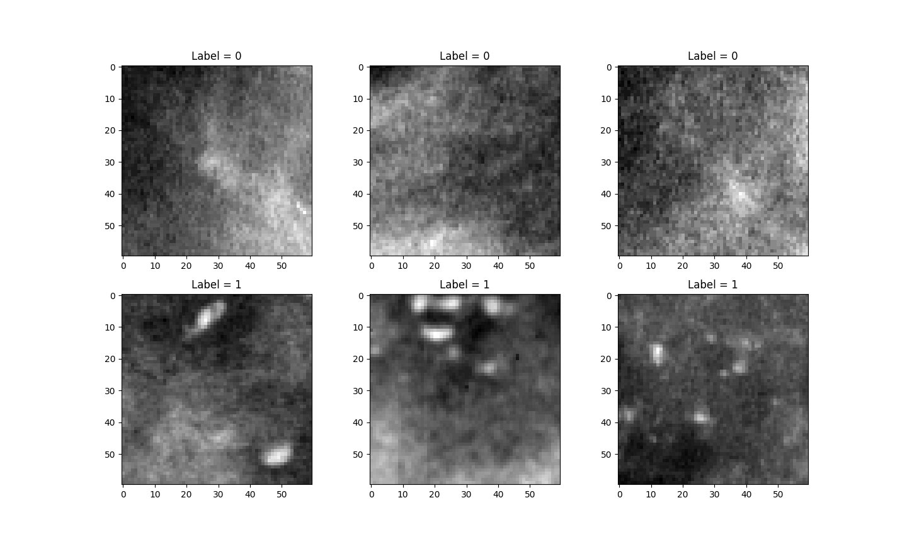
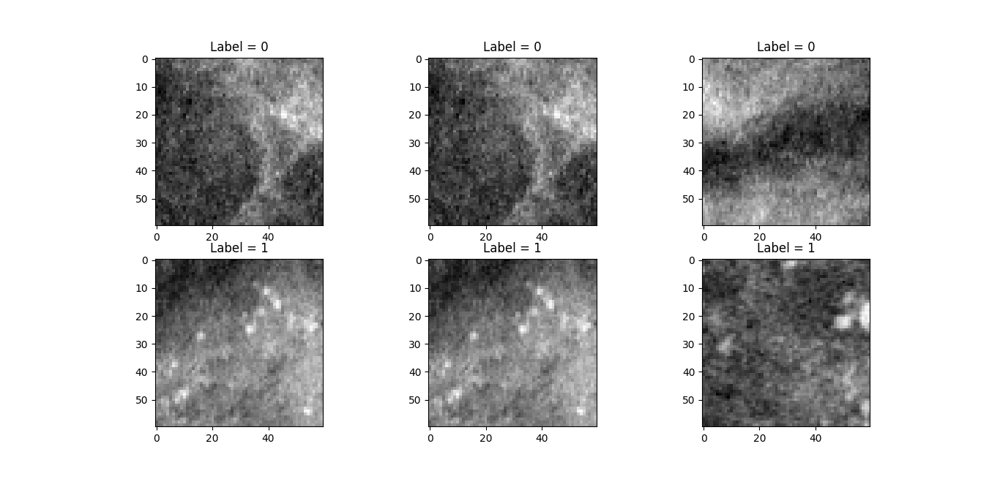
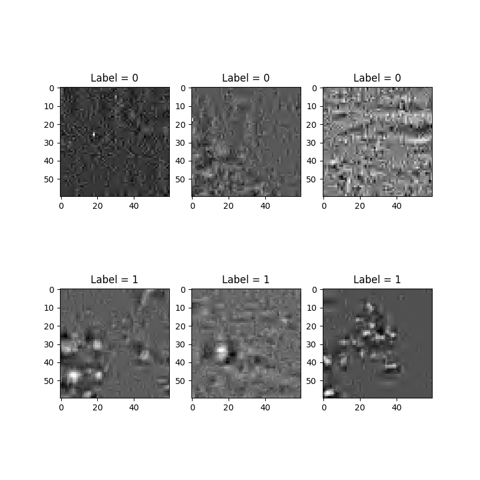
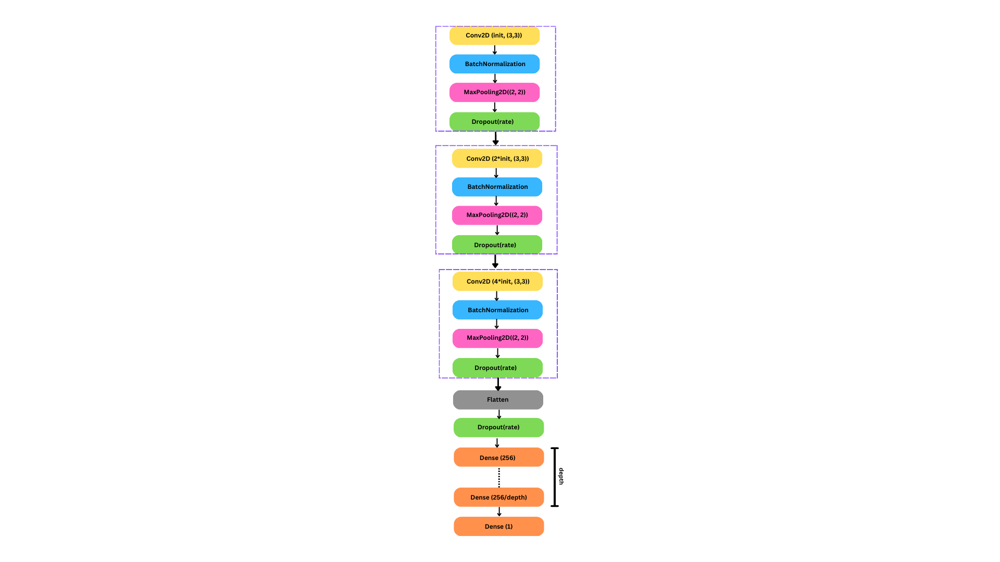

# Classificator for microcalcification in mammographies
The aim of this project is to create and train a neural network able to distinguish between benign and malign microcalcification masses in mammographies.

## Dataset
Dataset source: https://www.pi.infn.it/~boccali/DL_class_data.tar.gz  
This dataset is made up of **797** images, **414** of which represent sane tissue and the remaining **383** diseased tissue.  
 

## Data augmentation
Since medical datasets are usually *small* (a few hundred samples), oftentimes data augmentation procedures are performed. This should help preventing overfitting, hence it may improve both generalization and regularization of a given model.  
In this project, data augmentation is implemented using **ImageDataGenerator** by Keras. This tool applies a series of random transformations to the original images of the dataset (e.g. rotation, vertical/orizontal flip, contrast modification...).  
Here are some examples of images generated with this procedure.
 

## Wavelet-based filtering
Wavelet-based filters are often used in medical imaging in order to enhance images information content, which mostly means improving the visibility of features of interest. Different filters 
can be employed to realize image denoising or to make objects edges more distinguishable (increasing image contrast). In this project we are going to process mammography image portions showing microcalcifications, therefore the objects to be preserved are microcalcifications themselves (small bright spots), whereas the noise to be filtered out is the non-uniform image background (heterogeneous breast tissue). The steps to be followed are: loading images, implementing a 2-D Wavelet decomposition, analyzing the high spatial frequency (HF) and low spatial frequency (LF) components and finally obtaining filtered images using a 2-D Wavelet reconstruction.  
Among the many Wavelet families available, the best performing ones in our case are 'sym3' and 'haar'. The decomposition level is set to be 3 and so we will manipulate images' decomposition coefficients suppressing the approximation ones at level 3 (smoothed background intensity) and the detail coefficients at level 1 (noise). We can set thresholds for coefficients in terms of the standard deviations of their distributions and, for example, set to zero the "low spatial frequency approximation" information, while keeping only the "high spatial frequency details" that exceed a certain number of standard deviations (best performances obtained within 2 stdev.). 
Here are some examples of Wavelet-based filtering implememted on images from the dataset.
  
Default Wavelet settings are:  
| Parameters     |     Values    | 
| -------------- | ------------- |
| Wavelet family |      'sym3'   | 
| Threshold      |   1.5  stdev  | 

# Model selection and model assessment

## Hypermodel
The hypermodel is created using the following architecture.
  
Default hyperparameters space is set to be:  
| Hyperparameters |     Values    | 
| ----------------| ------------- |
| init            |  10, 20, 30   | 
| dropout rate    |  0, 0.05      | 
| depth           |   1, 2, 3     |    

## Training
The model selection and model assessment procedure is presented in the diagram below: given an hypermodel an hyperparameters space, the best model is selected with an **internal Hold-out** (Validation set = 25% of development set). A **K-fold** cross-validation (K=5) procedure is chosen to evaluate the model’s performance. 
 
At this point, we are left with 5 models (one for each fold), so an ensemble learning stategy is performed: each model is treated like an *expert*, so the final response of the ensemble comes from a weighted average of the single experts' predictions. These weights are trained to maximize the accuracy of the ensemble. 

## Performances

## GradCAM
The algorithm GradCAM for convolutional networks interpretability was employed to highlight which regions of the input images are relevant in the decision making process using a heatmap.
 